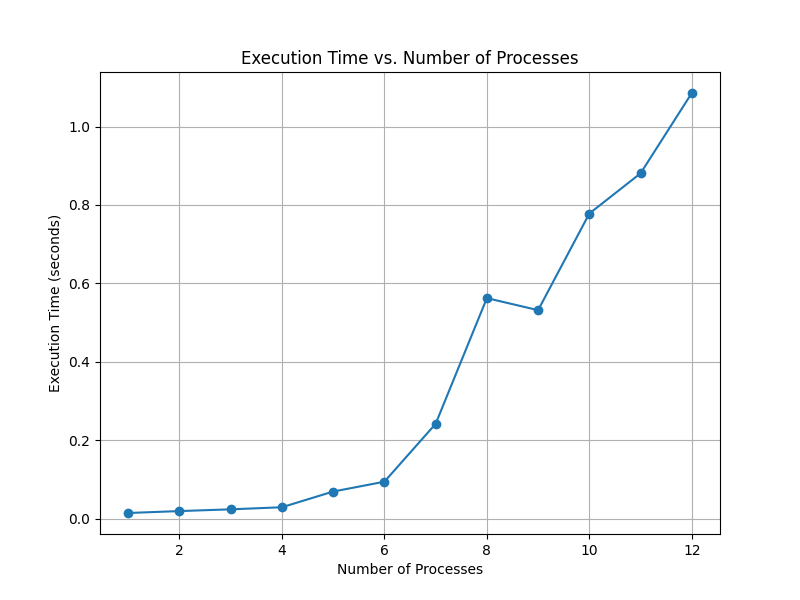
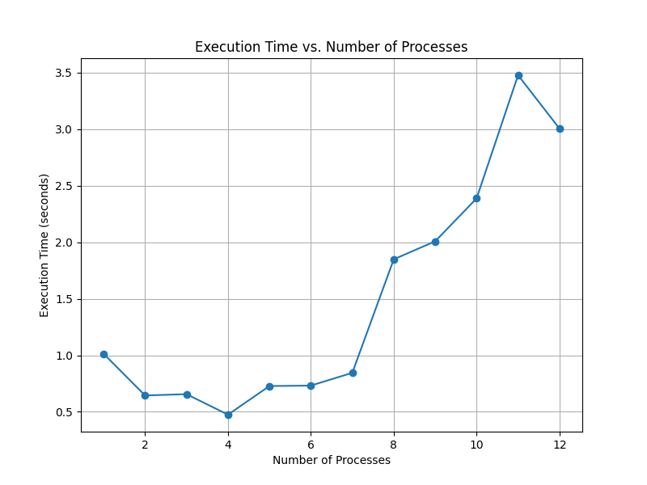

# Distributed Systems - Assignment 1
## Gowlapalli Rohit - 2021101113

## Question 1

### Distributed BFS

```
The graph is partitioned into equal parts and each process is assigned a set of vertices. When a vertex is visited, its neighbors are communicated to the corresponding process.
```

**Time Complexity:**

* **Factors:**
    * Graph traversal (BFS)
    * Data exchange (MPI communication)
* **Graph Partitioning:** O(V/size) per process
* **BFS Traversal:** 
    * O(V/size + E) per process
    * Communication overhead: O(d * V/size) 
    * Total: O(V/size + E + d * V/size)
* **Gathering Results:** O(V)

**Total Time:** O(V/size + E + d * V/size) + O(V)

**Space Complexity:**

* **Per Process:** O(V/size + E/size + L) 
    * Adjacency list
    * Level array
    * Blocked set
* **Total System:** O(V + E + L)

**Message Complexity:**

* **Initial Distribution:** O(E) 
* **BFS Traversal:** O(V * d) 

**Total Messages:** O(V * d)

**Summary:**

* **Time:** O(V/size + E + d * V/size) + O(V)
* **Space:** O(V + E + L)
* **Messages:** O(V * d)

### Scaling Analysis




## Question 2

#### Distributed Particle Simulation
```
The grid is divided into rows and each process is assigned a set of rows. When a particle moves to a different row, it is communicated to the corresponding process. 
```

**Time Complexity:**

* **Initialization:** O(K) 
    * Reading K particles and assigning them to processes.
    * Broadcasting N, M, K, T: O(log P) 
* **Particle Movement & Collision Handling:** O(T * K)
    * Per iteration: 
        * Updating positions: O(K/P) 
        * Communication: O(K/P) 
        * Erasing invalid particles: O(K/P)
        * Collision handling: O(K/P)
* **Gathering Results:** 
    * Sorting particles: O(K log K)
    * Gathering particles: O(K + P)

**Space Complexity:**

* **Per Process:** O(K/P) (particles, collision handling data)
* **Global (Rank 0):** O(K) (gathered particles)

**Message Complexity:**

* **Broadcasting Constants:** O(log P)
* **Particle Communication:** O(T * K)
* **Gathering Results:** O(K + P)

**Summary:**

* Time: O(T * K + K log K)
* Messages: O(T * K + P)
* Space: O(K + K/P)



## Question 3
* **Nodes and Chunks:**
    * N: Total number of nodes.
    * C: Number of chunks in a file.
    * F: Number of failed nodes.
    * Replication: Each chunk has a replication factor of 3.
    * Storage: The chunk size is CHUNK_SIZE.
* **Heartbeat:** All nodes send periodic heartbeat messages to the metadata server.

**Time Complexity**

* **Upload:** O(C * N) 
    * Chunk Upload: O(N) per chunk (replica node selection)
* **Retrieve:** O(C)
    * Replica Search and Retrieval: O(1) per chunk
* **Search:** O(C * W) 
    * Node Selection: O(C)
    * Word Search: O(W) per chunk (where W is the average words per chunk)
* **Heartbeat:** O(N) 
    * All nodes send heartbeats to the metadata server.
* **Failover/Recover:** O(C * N) 
    * Node Selection for Re-replication: O(N) per chunk

**Space Complexity**

* **Metadata Server:** O(F * C)
    * File metadata: O(F)
    * Chunk metadata: O(C) per file
* **Storage Nodes:** O(F * C * CHUNK_SIZE)
    * Chunk data: O(C * CHUNK_SIZE) per file

**Message Complexity**

* **Upload:** O(C)
    * 12 messages per chunk (4 messages per replica)
* **Retrieve:** O(C)
    * 4 messages per chunk (metadata request + data retrieval)
* **Search:** O(C)
    * 4 messages per chunk (similar to retrieval)
* **Heartbeat:** O(N)
    * N - 1 heartbeat messages
* **Failover/Recover:** O(C)
    * Metadata updates during re-replication

**Summary**
* **Overall Time Complexity:** O(C * N + C * W + N) 
* **Overall Space Complexity:** O(F * C * CHUNK_SIZE + F * C) 
* **Overall Message Complexity:** O(C * 12 + N)


# Assumptions

### Question 1

- 1D grid partitioning of the graph.

### Question 2

- 1D grid partitioning of the matrix
- It is assumed that particles cannot collide at the start of the simulation.

### Question 3

- Distributed Search is done by fetching only the relevant chunks that have a complete match with search word or if their suffix or prefix is a substring of the search word.
- Heartbeat Interval is 500ms and Failover Interval is 1500ms
- Load balancing is done by always pciking storage nodes with the least number of chunks. (When a node fails, the chunks count of the node becomes zero)
- It was assumed that there are no time constraints on the upload and retrieval of chunks. The system is optimized for fault tolerance and load balancing.